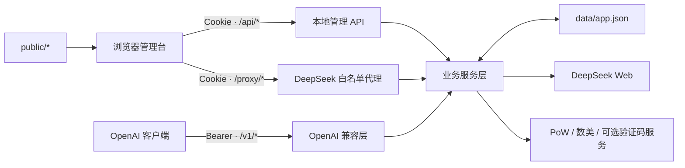
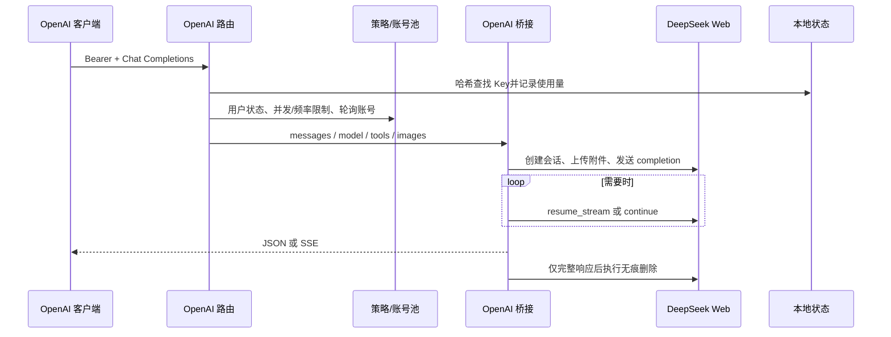
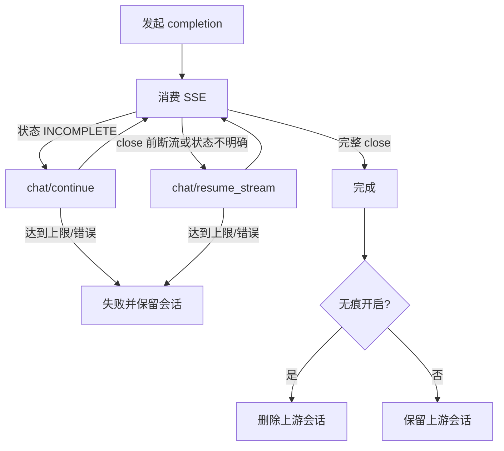

# 架构说明

## 总览

deepseek2api 是一个单进程 Node.js 服务。浏览器静态资源、本地管理 API、OpenAI 兼容层和 DeepSeek 白名单代理共享同一个 HTTP Server 与同一份 JSON 状态。

Node.js 端没有第三方运行时包，也没有路由框架或数据库驱动。浏览器页面会从外部 CDN 加载字体、Lucide 和 GSAP，详见[安全与隐私](security-and-privacy.md)。

## 进程入口与分发

`src/server.js` 使用 `node:http` 创建 Server，并按路径前缀顺序分发：

| 路径 | 处理器 | 认证 |
| --- | --- | --- |
| `/api/*` | `routes/api-routes.js` | 公共路由免认证，其余使用会话 Cookie |
| `/proxy/*` | `routes/proxy-routes.js` | 会话 Cookie |
| `/v1/*`、`/models` | `routes/openai-routes.js` | 本地 Bearer API Key |
| 其他 | `utils/http.js` 静态文件服务 | 无 |

服务统一设置 CORS 响应头，处理 `OPTIONS`，并在未开始响应时把异常转换为脱敏 JSON。请求和套接字超时被设为 `0`，长时间 SSE 由各流处理器发送心跳。

## 代码分层

### `src/routes/`

- `auth-routes.js`：会话状态、发现、协议清单、登录、注册和退出。
- `private-routes.js`：账号、验证码、API Key、请求日志、无痕和个人实验开关。
- `admin-routes.js`：注册策略、共享账号、系统设置、邀请码和用户管理。
- `openai-routes.js`：模型列表和 Chat Completions。
- `proxy-routes.js`：代理白名单、账号范围、逻辑流转发和无痕清理。
- `api-routes.js`：公共、管理员和私有管理路由的认证编排。

### `src/services/`

主要职责组：

| 领域 | 关键模块 |
| --- | --- |
| 本地身份与所有权 | `auth-service.js`、`user-service.js`、`session-service.js`、`owner-service.js` |
| 账号与密钥 | `account-service.js`、`account-import-service.js`、`api-key-service.js`、`account-rotation-service.js` |
| DeepSeek 协议 | `deepseek-proxy.js`、`deepseek-protocol.js`、`deepseek-device.js`、`deepseek-settings.js` |
| 完成流可靠性 | `deepseek-input-chunking.js`、`deepseek-completion-stream.js`、`deepseek-chat-response.js` |
| OpenAI 适配 | `openai-request.js`、`openai-bridge.js`、`openai-completion-runner.js` |
| 工具调用 | `openai-tool-policy.js`、`openai-tool-prompt.js`、`openai-tool-sieve.js`、`openai-tool-parsing-mode.js` |
| 风控 | `pow-solver.js`、`pow-utils.js`、`captcha-service.js`、`deepseek-frequency-retry.js` |
| 策略 | 请求限制、无痕、共享账号、实验提示词和系统设置服务 |

### `src/storage/` 与 `src/utils/`

- `storage/store.js`：默认状态、兼容迁移、规范化与同步 JSON 读写。
- `utils/http.js`：请求体、Cookie、JSON、静态文件与缓存头。
- `utils/deepseek-sse.js`：DeepSeek SSE 解析。
- `utils/privacy.js`：标识掩码与敏感错误脱敏。
- `utils/id.js`：UUID、随机密钥与 SHA-256 哈希。

### `public/`

浏览器端使用原生 ES Modules 和普通 CSS，没有打包器。`index.html` 提供页面骨架，其余模块按身份、会话、账号、聊天、设置和动画职责拆分。

## 身份与所有权模型

本地身份分为管理员与普通用户：

- 管理员由 `.env` 中的固定凭据启用，所有者 ID 为 `admin`。
- 普通用户保存在 `data/app.json`，所有者 ID 由用户 UUID 派生。
- 登录成功后创建 7 天会话，Cookie 名为 `ds_reverse_session`。
- 普通用户只看到自己的账号和 API Key；管理员可看到全部账号。
- 禁用用户时立即删除其现有会话。

API Key 记录绑定所有者和一个账号。普通模式只在该所有者的可用账号池内轮询；共享账号模式使用全局可用账号池，但创建 Key 的用户仍必须先绑定自己的可用账号。

## OpenAI 请求流

详细步骤：

1. 对传入 Key 做 SHA-256 后查找记录，并更新本地日期口径的当日调用量。
2. 检查用户是否禁用及内存中的并发、每分钟请求限制。
3. 从所有者账号池或共享池按轮询游标选择可用账号。
4. 校验模型、搜索方式、工具权限、图片和文件限制。
5. 把 OpenAI messages 组装为上游 prompt；工具定义会转换为提示词协议。
6. 上传图片或使用 `ref_file_ids`；Expert 模型拒绝附件。
7. 超出输入字符上限时，在同一上游会话分段发送。中间段等 `ready` 和首个持久化消息帧后停止，附件只放最后一段。
8. 消费最终 completion，并合并思考与正文增量。
9. 上游传输在 `close` 前结束时调用 `resume_stream`；消息仍为 `INCOMPLETE` 时调用 `continue`。
10. 多次响应使用快照重叠去重，向客户端呈现单个逻辑结果。
11. 仅匹配特定“消息发送过于频繁”错误时等待 30 秒并切换池内账号，默认最多重试 3 次。
12. 只有确认完整后才执行无痕会话删除；失败时保留可恢复会话。

## 完成流状态

恢复和继续的默认上限均为 12，可通过环境变量调整。

## 原生代理请求流

1. 从 Cookie 解析本地会话并校验用户状态。
2. 把 `/proxy/<suffix>` 映射为 `/api/<version>/<suffix>`。
3. 检查静态白名单；不允许任意上游路径。
4. 在会话可见范围内解析 `x-proxy-account-id`，缺省使用第一个可见账号。
5. 注入账号稳定客户端档案、上游 token 和必要的 PoW。
6. 对 `/chat/completion` 使用与 OpenAI 层相同的分段、恢复、继续与无痕语义。
7. 其他白名单路径按流转发，并移除上游 Cookie 与 hop-by-hop 响应头。

## 状态与内存

持久状态位于 `data/app.json`。每次读取会执行规范化，旧字段可能在读取时被迁移并重写。写入是同步的整文件写入，未实现跨进程锁或外部事务。

以下状态只存在内存中，进程重启会丢失：

- 最近 500 条请求日志；
- 用户并发计数与一分钟请求时间窗；
- 账号轮询游标；
- 正在进行的 SSE、重试和 PoW 预取状态。

因此部署模型应保持单进程、单实例。多实例共享同一个 `data/app.json` 不安全，多个独立数据库实例又会产生状态分裂。

## 关键边界

- OpenAI 兼容是子集，不是完整协议实现。
- 上游 Web 协议、WASM 和风控服务都是易变依赖。
- JSON 存储适合小规模单实例，不适合高可用或高并发数据库场景。
- 请求体上限固定为 110 MiB；输入字符分段上限是另一项独立设置。
- Server 本身没有 TLS、监听地址、CSP、登录防爆破或分布式限流设施。

部署风险与缓解方式见[安全与隐私](security-and-privacy.md)和[运维指南](operations.md)。
